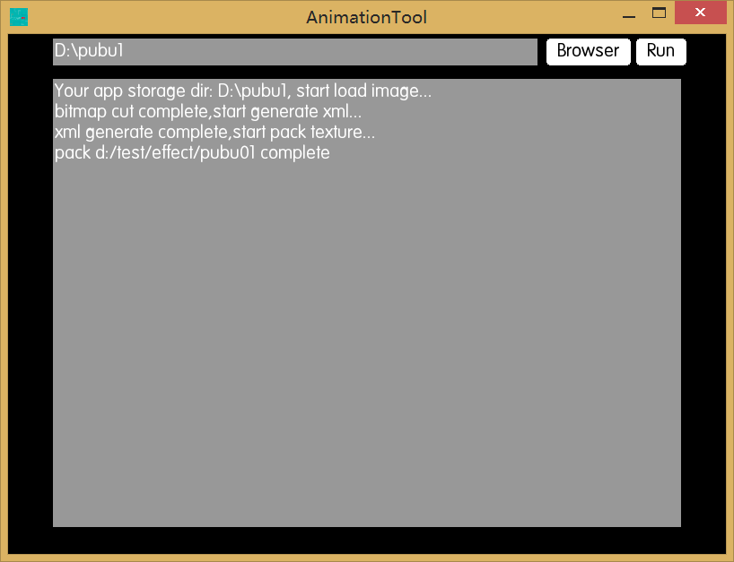

#AnimationTool
AnimationTool is a tool for generate animation config to pack with [TexturePacker](https://www.codeandweb.com/texturepacker).

It cut the bitmap without transparent area,and save the offset to xml for animation to location itself.

It's wirte base on Haxe 3 and OpenFL/Lime.

##usage
+ Modify the [ParhConfig.txt](assets/PathConfig.txt) and set the `tpbin` to texturepacker dir,`output` is the dir where you wish generate file.
+ Select a folder to begin
+ You will get a xml about offset under effect,a xml about all animation collection and a png pack by texturepacker,the processPath is temp for cut single image and should ignore

##attention
+ You must enable the command mode of TexturePacker